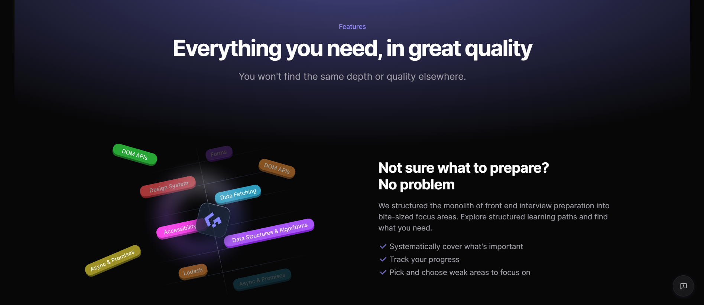

# Technex:

##Project Report
##TECHNEX
To Fulfill the Requirements for
2nd Year Project

##Submitted to
Department of Computer Science & Engineering
Chitkara University, Punjab

##Under the Supervision of
Mr. Mananjay Dubey

##Submitted by

2310990736 – Megha
2310990737 – Mehak
2310990747 – Nandini Jhunjhunwal
2310990755 – Nomita Patwal

##TechNex - Frontend Interview Preparation App

TechNex is an inline frontend web application designed to help individuals prepare for frontend development interviews. It offers a wide range of resources, practice problems, and real-world coding challenges to help users enhance their skills in HTML, CSS, JavaScript, and more.

##Table of Contents
i)Project Overview
ii)Features
iii)Technologies Used
iv)Installation
v)Usage
vi)UML Diagrams
vii)Database Design

##Project Overview
TechNex aims to bridge the gap in frontend developer interview preparation by providing a structured learning path, real-time code testing, interactive problem-solving, and company-specific questions. The platform is built to simulate real interview environments, allowing users to develop the skills required for success in the field.

##Features
1.User Management
1) Secure registration and login functionality.
2).User profiles with coding experience and achievements.
2.Coding Practice
1).Extensive problem database categorized by difficulty and topic.
2).Interactive, in-browser code editor with syntax highlighting.
3.Real-Time Feedback
1).Instant feedback on code submissions.
2).Hints and solutions available for difficult problems.
4.Dashboard
1).Personalized dashboard to track progress and earned certificates.
5.Responsive Design
Fully responsive for use on mobile, tablet, and desktop.
##Technologies Used
1.HTML5 - For structuring the frontend pages.
2.CSS3 & Bootstrap - For responsive and modern UI design.
3.JavaScript - For dynamic and interactive functionality.
4.Local Storage - To store user data locally in the browser.
5.Figma - Used for designing the user interface.

